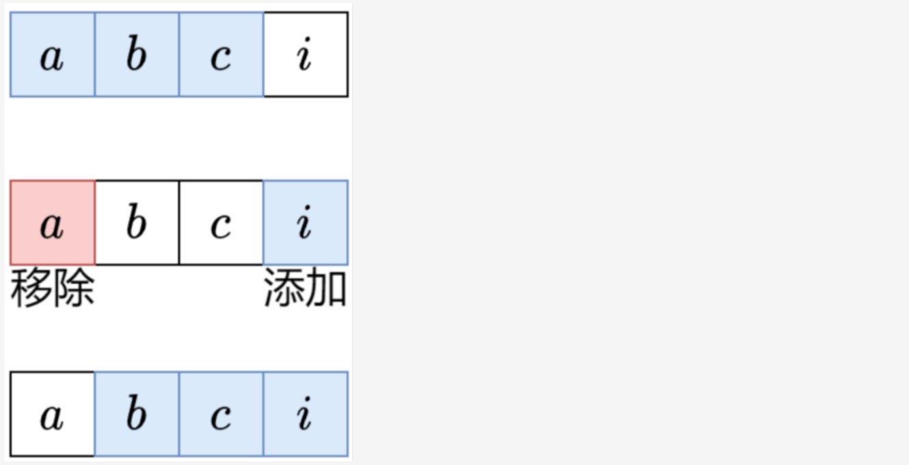

# 滑动窗口
> 属于双指针的一种，常用于数据结构为数组（列表）、字符串类型的题目

当一道题目能用 **滑动窗口解决** 时，它一般符合以下三个特征：  
- 题目背景的数据结构为**数组**（列表）、**字符串**
- 题目需要求 “满足条件的**子数组**（列表）、**子字符串**个数”，或 “满足条件的子数组（列表）、子字符串的最大长度或个数”
- 滑动窗口适用的题目往往具有 **单调性**

## 一、定长滑动窗口
**1. 题目类型**
- 题目明确说明需要 **找一个大小为k** 的子数组（列表）、字符串，使其满足题目条件
- 题目要求在**固定大小的窗口上进行统计或优化**，例如 “统计该窗口内某类元素的个数”，或 “计算和、最大值、平均值等”

**2. 解题思路：入-更新-出**
> 准备： 定位左右指针、判断窗口滑动轨迹、定循环边界  
> 【可选：1、 判断是否初始值赋值（减少循环次数） 2、需判断元素是否相同的可以用map记录】
1. **入**：下标为 i 的元素进入窗口，更新相关统计量。如果窗口左端点 i−k+1<0，则尚未形成第一个窗口，重复第一步。
2. **更新**：更新答案。一般是更新最大值/最小值。  
3.  **出**：下标为 i−k+1 的元素离开窗口，更新相关统计量，为下一个循环做准备。  

## 二、不定长滑动窗口
**1. 题目类型**
不定长滑动窗口主要分为三类：求最长子数组，求最短子数组，求子数组个数。

**2.解题思路：**
枚举右端点，缩小左端点
> 注：滑动窗口相当于在维护一个队列。右指针的移动可以视作入队，左指针的移动可以视作出队。

### (一)越短越合法-求最长/最大
**1. 题目类型**
> “越短越合法”是指：在滑动窗口问题中，窗口的长度越短，就越容易满足题目所给的“合法”条件；随着窗口变长，条件被破坏的可能性越大，窗口会变得“不合法”。
- 题目要求在**窗口内的元素满足某种条件**的情况下，求窗口的最大长度或个数。
- 题目背景的数据结构为**数组**（列表）、**字符串**
- 单调性：while条件从不满足要求（不断的收缩左边界）变成满足要求

**2.解题思路：**
对于这类“求最长”的问题，当右指针移动导致窗口不合法时，我们必须收缩左边界（让窗口变短），直到窗口重新合法。这正是滑动窗口的标准策略：先扩展右边界，一旦不合法，就收缩左边界，在合法范围内记录最长长度。

### (二)越长越合法-求最短/最小
**1. 题目类型**
> “越长越合法”是指：在滑动窗口问题中，窗口的长度越长，就越容易满足题目所给的“合法”条件；随着窗口变短，条件被破坏的可能性越大，窗口会变得“不合法”。
- 题目要求在**窗口内的元素满足某种条件**的情况下，求窗口的最小长度或个数。
- 题目背景的数据结构为**数组**（列表）、**字符串**
- 单调性：while条件从满足要求（不断的收缩左边界）变成不满足要求，以求最短

**2.解题思路：**
对于这类“求最短”的问题，当右指针移动时，如果仍合法，收缩左边界，直到窗口不合法求最短。如果不合法，继续移动右指针。

## 三、求子数组个数
### (一)越短越合法
**1.解题思路**
一般要写 ans += right - left + 1。
内层循环结束后，[left,right] 这个子数组是满足题目要求的。由于子数组越短，越能满足题目要求，所以除了 [left,right]，还有 [left+1,right],[left+2,right],…,[right,right] 都是满足要求的。也就是说，当右端点固定在 right 时，左端点在 left,left+1,left+2,…,right 的所有子数组都是满足要求的，这一共有 right−left+1 个。

### (二)越长越合法
**1.解题思路**
一般要写 ans += left。
内层循环结束后，[left,right] 这个子数组是不满足题目要求的，但在退出循环之前的最后一轮循环，[left−1,right] 是满足题目要求的。由于子数组越长，越能满足题目要求，所以除了 [left−1,right]，还有 [left−2,right],[left−3,right],…,[0,right] 都是满足要求的。也就是说，当右端点固定在 right 时，左端点在 0,1,2,…,left−1 的所有子数组都是满足要求的，这一共有 left 个。
我们关注的是 left−1 的合法性，而不是 left。

### (三)恰好型滑动窗口
**1.解题思路**
例如，要计算有多少个元素和恰好等于 k 的子数组，可以把问题变成：
- 计算有多少个元素和 ≥k 的子数组。
- 计算有多少个元素和 >k，也就是 ≥k+1 的子数组。

答案就是元素和 ≥k 的子数组个数，减去元素和 ≥k+1 的子数组个数。这里把 > 转换成 ≥，从而可以把滑窗逻辑封装成一个函数 solve，然后用 solve(k)−solve(k+1) 计算，无需编写两份滑窗代码。

总结：「恰好」可以拆分成两个「至少」，也就是两个「越长越合法」的滑窗问题。

> 注：也可以把问题变成 ≤k 减去 ≤k−1，即两个「至多」。可根据题目选择合适的变形方式。
> 注：也可以把两个滑动窗口合并起来，维护同一个右端点 right 和两个左端点 left1 和 left2，我把这种写法叫做三指针滑动窗口。
