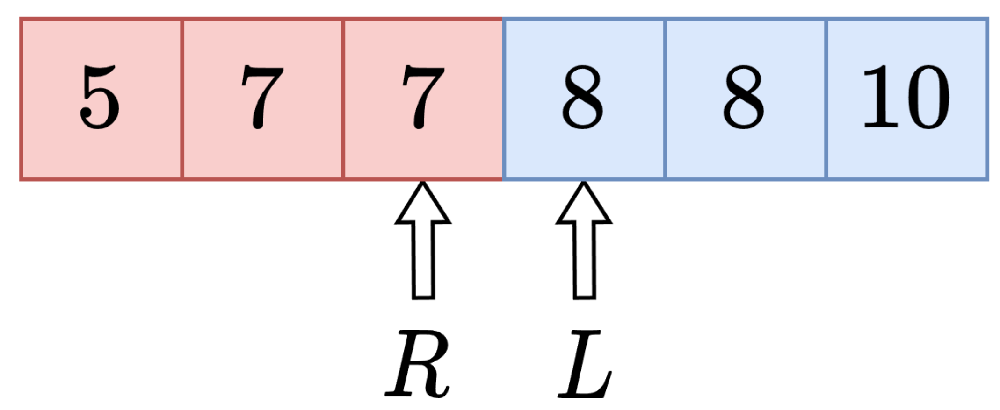
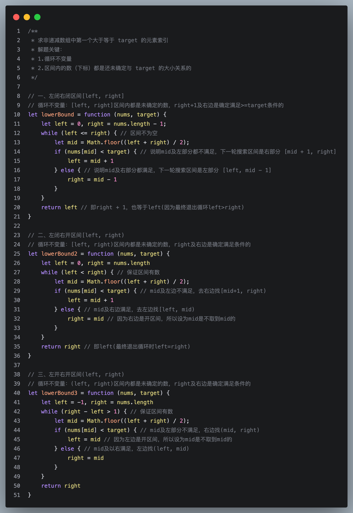

# 二分算法

## 一、二分查找
**1. 题目类型**
在二分查找中，题目通常会给定一个**有序数组**，要求我们在数组中**查找一个目标值**。
> 变式：查找某个元素出现的个数=》lb(x+1) - lb(x)

**2.解题思路**

> 暴力枚举没有利用到数组的有序性，因此时间复杂度为O(n)；而二分查找利用数组的有序性，每次都可以将查找范围减半，因此时间复杂度为O(logn)

1. “关键不在于区间里的元素具有什么性质，而是区间外面的元素具有什么性质。”
2. **“循环不变量”**
 - left（不包含left）的左边都小于 x
 - right（不包含right）的右边都大于等于 x。
    无论是开区间还是闭区间的写法都有这么一个前提。因此当<u>区间选定</u>之后，可以判断出**循环条件**（区间中有数字就继续循环），如何**更新left和right**（根据循环不变量可以判断），**返回谁**（根据循环条件以及循环不变量能够知道left和right的含义）。
3. 区间内的数（下标）都是还未确定与 target 的大小关系的

**3.常用转化**

> 设 *nums* 为递增（非递减）数组，长为 *n*。

| 需求                      | 写法                         | 如果不存在 |
| ------------------------- | ---------------------------- | ---------- |
| ≥x 的第一个元素的下标     | lowerBound(*nums*,*x*)       | 结果为 n   |
| \>*x* 的第一个元素的下标  | lowerBound(*nums*,*x*+1)     | 结果为 n   |
| <*x* 的最后一个元素的下标 | lowerBound(*nums*,*x*) - 1   | 结果为 −1  |
| ≤*x* 的最后一个元素的下标 | lowerBound(*nums*,*x*+1) - 1 | 结果为 −1  |

| 需求            | 写法                         |
| --------------- | ---------------------------- |
| <*x* 的元素个数 | lowerBound(*nums*,*x*)       |
| ≤*x* 的元素个数 | lowerBound(*nums*,*x*+1)     |
| ≥*x* 的元素个数 | n - lowerBound(*nums*,*x*)   |
| >*x* 的元素个数 | n - lowerBound(*nums*,*x*+1) |

> 注意 <*x* 和 ≥*x* 互为补集，元素个数之和为 *n*。≤*x* 和 >*x* 同理。

## 二、二分答案
1. **题目类型**
在二分答案中，题目通常会给定一个**范围**，要求我们在这个范围中**查找一个满足条件的答案**。
只要目标函数关于答案单调，就可以二分查找。

2. **解题思路**
题目求什么，就二分什么。对答案进行二分查找。

3. **其他**
问：如何把二分答案与数组上的二分查找联系起来？
答：假设答案在区间 [2,5] 中，我们相当于在一个虚拟数组 [check(2),check(3),check(4),check(5)] 中二分找第一个（或者最后一个）值为 true 的 check(x)。二分答案check(i)的单调性其实对应二分查找的前提有序数组的单调性。同样可以用红蓝染色法思考。